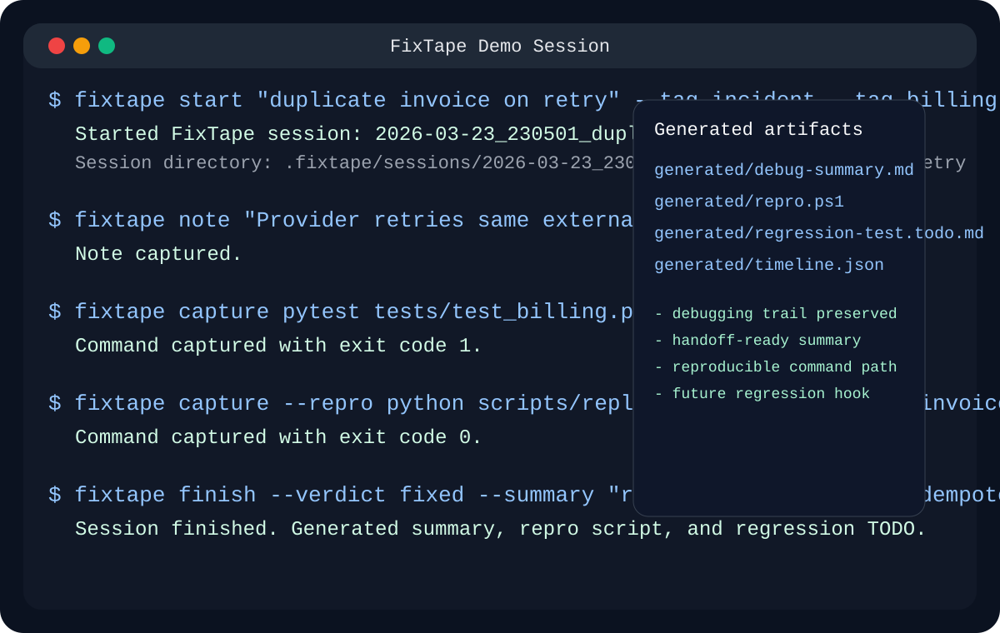

# FixTape

[](https://pypi.org/project/fixtape/)
[](https://github.com/Py2755/FixTape/actions/workflows/ci.yml)
[](LICENSE)
[](pyproject.toml)
[](pyproject.toml)

FixTape is a local-first CLI that turns debugging sessions into reusable engineering artifacts.

Instead of ending a hard bug hunt with just a patch and a vague memory, FixTape gives you:
- a structured debugging summary,
- a reproducible command trail,
- attached evidence such as traces, logs, and payloads,
- Git-aware snapshots of the code context,
- and a handoff package another engineer can actually use.



## The pitch

When a hard bug is finally fixed, most teams still lose the most expensive part of the work:
- how the issue was reproduced,
- which commands mattered,
- which traces were useful,
- which hypothesis was discarded,
- why the final fix won,
- and how the team can prove the bug stays fixed.

FixTape preserves that path.

It is not a debugger.
It is not a note-taking app.
It is a debugging memory layer.

## Why it feels different

Most developer tools help you:
- write code faster,
- inspect state faster,
- or generate code faster.

FixTape helps you **not lose the investigation itself**.

That makes it useful for:
- backend debugging,
- flaky integration failures,
- infra incidents,
- reproducible handoffs,
- and turning debugging effort into regression assets.

## What you get

At the end of a debugging session, FixTape can generate:
- `generated/handoff.md`
- `generated/debug-summary.md`
- `generated/session-digest.md`
- `generated/session-digest.json`
- `generated/parsed-artifacts.json`
- `generated/repro.ps1` or `generated/repro.sh`
- `generated/regression-test.todo.md`
- `generated/regression-draft.json`
- `generated/timeline.json`
- copied artifacts such as traces, logs, payloads, and command outputs

## Command set

Current commands:
- `fixtape start <title> [--include-last 40m]`
- `fixtape status`
- `fixtape doctor [--window 40m]`
- `fixtape suggest-start [--window 20m]`
- `fixtape promote --include-last 40m`
- `fixtape note "<text>"`
- `fixtape link <ticket|issue|commit|pr|branch|doc|other|current-commit> [value]`
- `fixtape refs [session-id]`
- `fixtape run [--repro] <command...>`
- `fixtape capture [--repro] <command...>`
- `fixtape attach <kind> <path>`
- `fixtape snapshot`
- `fixtape finish --verdict <fixed|unresolved|handoff|needs-more-data> [--include-last 40m]`
- `fixtape list`
- `fixtape show [session-id]`
- `fixtape digest [session-id]`
- `fixtape similar [session-id]`
- `fixtape patterns`
- `fixtape clusters`
- `fixtape hotspots`
- `fixtape lenses`
- `fixtape regressions`
- `fixtape outcomes`
- `fixtape playbooks`
- `fixtape recipes`
- `fixtape triage <query>`
- `fixtape kickoff <title> --query <query> [--include-last 40m]`
- `fixtape search <query>`
- `fixtape reindex`
- `fixtape shell-init <powershell|bash|zsh|sh>`
- `fixtape export <destination.zip>`

## 60-Second Quickstart

### 1. Install

From PyPI (recommended):

```bash
pip install fixtape
```

Or with [pipx](https://pipx.pypa.io/) (isolated install, no conflicts):

```bash
pipx install fixtape
```

From source (for development):

```bash
git clone https://github.com/Py2755/FixTape.git
cd FixTape
python -m pip install -e .
```

### 2. Start a session

```powershell
fixtape start "billing webhook duplicates charges" --tag incident --tag backend --include-last 40m
```

### 3. Capture the investigation

```powershell
fixtape note "Can reproduce only with retry header present"
fixtape capture pytest tests/test_webhook.py -k duplicate
fixtape attach trace traceback.txt
fixtape attach payload failing_event.json
fixtape snapshot
```

### 4. Finalize the fix

```powershell
fixtape note "Root cause was idempotency key ignored on retry path"
fixtape capture --repro python scripts/replay_event.py failing_event.json
fixtape finish --verdict fixed --summary "Retry path now respects idempotency keys" --ref ticket:PAY-123 --ref commit:abc123 --include-last 20m
```

### 5. Revisit the result

```powershell
fixtape list
fixtape show
fixtape digest
fixtape similar
fixtape patterns
fixtape clusters
fixtape hotspots --kind file
fixtape lenses
fixtape regressions
fixtape outcomes
fixtape playbooks
fixtape recipes
fixtape triage "retry storm payments"
fixtape kickoff "payments retry gamma" --query "retry storm payments" --include-last 40m
fixtape doctor --window 40m
fixtape suggest-start --window 20m
fixtape promote --include-last 40m
fixtape search retry
fixtape link ticket PAY-123
fixtape export .\fixtape-session.zip
```

`fixtape search` now ranks stronger matches above weaker ones and shows compact field-labeled snippets, so title and summary hits naturally rise above low-signal substring matches.

`fixtape search --field signals` can now search parsed failure signals directly, including exception types, stack-trace families, HTTP failures, and file hints.

FixTape now also maintains a local cross-session index in `.fixtape/session-index.json`, which powers faster `list` and `search` across accumulated debugging history.

FixTape now also builds a second layer of cross-session intelligence:
- `fixtape similar` finds sessions with matching failure fingerprints, exception types, refs, and command patterns
- `fixtape patterns` highlights recurring failure clusters across your debugging history

FixTape now also has history-level intelligence views:
- `fixtape clusters` groups connected incidents that keep rhyming across time
- `fixtape hotspots` shows which files, exceptions, families, status codes, or fingerprints keep reappearing
- `fixtape lenses` compresses the history into root-cause lenses and common next steps

FixTape now also writes a compact session digest on finish:
- one-line summary of the case
- likely failure family and area
- root-cause hint
- next recommended step

FixTape now also keeps higher-level engineering memory:
- `fixtape regressions` shows recurring regression-test opportunities across repeated failure classes
- `fixtape outcomes` shows what kinds of failures the team actually fixes, hands off, or leaves under-specified

FixTape can now also emit repeatable guidance from history:
- `fixtape playbooks` surfaces common first moves, artifacts, and entry points for repeated failure families
- `fixtape recipes` turns repeated failure buckets into concrete “if you see this, start here” workflows

FixTape can now also use that history at incident start:
- `fixtape triage` suggests the best historical starting point for a current signal
- `fixtape kickoff` starts a new session and writes an incident kickoff bundle with the best known first move

FixTape now also has a zero-touch flight recorder:
- shell hooks can keep buffering the last commands even before a session exists
- `fixtape doctor` shows what is currently buffered
- `fixtape suggest-start` detects likely incident onset from failure bursts and traceback signals
- `fixtape suggest-start` now scores suggestions by incident type, not just by generic fail volume
- `--include-last 40m` can promote buffered command history into `start`, `kickoff`, `promote`, or `finish`
- `fixtape capture` records full stdout/stderr into the buffer even outside an active session

Refs can now be linked directly after or during a session:

```powershell
fixtape link ticket PAY-123
fixtape link issue 481
fixtape link current-commit
fixtape refs
```

`fixtape export` now creates a richer handoff bundle with:
- top-level `HANDOFF.md`
- top-level `SUMMARY.md`
- top-level repro and regression TODO entry points
- `metadata.json` with related refs such as tickets or commits
- the full original session nested under `session/`

FixTape also drafts regression-test inputs from captured evidence:
- suggested test name
- candidate reproduction entry point
- likely fixture files from payload/config artifacts
- refs linked during `finish`
- candidate assertions inferred from the debugging trail

FixTape now also parses failure signals from attached traces and captured command outputs:
- Python tracebacks
- common Node/JavaScript stack traces
- Java stack traces
- HTTP 4xx/5xx failures
- common SQL failures
- pytest-style failures
- generic high-signal error lines from stderr and log-like artifacts
- command-level non-zero exit failures when no stderr artifact is available

## Optional shell helpers

FixTape can print shell helpers so you can use short wrappers during debugging sessions.

PowerShell:

```powershell
Invoke-Expression (& fixtape shell-init powershell)
ft pytest tests/test_billing.py -k duplicate
ftr python scripts/replay_invoice.py failing_invoice.json
ftnote "Root cause likely sits in retry path"
ftsnap
ftdoctor
ftsuggest
```

POSIX shells:

```bash
eval "$(fixtape shell-init bash)"
ft pytest tests/test_billing.py -k duplicate
ftr python scripts/replay_invoice.py failing_invoice.json
ftnote "Root cause likely sits in retry path"
ftsnap
ftdoctor
ftsuggest
```

`ft` and `ftr` now go through `fixtape capture`, so they work both inside and outside an active session while preserving full stdout/stderr output.

## Zero-touch flight recorder

If you want lighter capture without remembering `fixtape start` first, FixTape can now keep a local pre-session flight recorder.

PowerShell:

```powershell
Invoke-Expression (& fixtape shell-init powershell --mode all)
```

Bash:

```bash
eval "$(fixtape shell-init bash --mode all)"
```

What the flight recorder captures automatically:
- command line
- exit code
- current working directory
- shell source
- recent command history before a session exists

What `fixtape capture` adds on top:
- full stdout/stderr files in the recorder
- reproducible command marking
- promotion into the active session if one exists

Suggested workflow:

```powershell
Invoke-Expression (& fixtape shell-init powershell --mode all)
pytest tests/test_billing.py -k duplicate
python scripts/replay_invoice.py failing_invoice.json
fixtape doctor --window 40m
fixtape suggest-start --window 20m
fixtape start "billing retry storm" --include-last 40m
```

That gives you the low-friction "black box" path first, then turns the last part of the investigation into a proper FixTape session once you decide the incident matters.
If the last commands look like a real investigation, shell hooks can also print a one-line suggestion automatically instead of forcing a hard auto-start.

The suggestion layer is now type-aware:
- test failures prefer `test regression`
- Python/Node/Java tracebacks prefer runtime incident types
- HTTP 5xx bursts prefer API failure suggestions
- SQL signals prefer database failure suggestions
- and repeated historical families can upgrade the recommendation from plain `start` to `kickoff`

## Example session flow

```powershell
fixtape start "billing webhook duplicates charges" --include-last 40m
fixtape note "Can reproduce only with retry header present"
fixtape capture pytest tests/test_webhook.py -k duplicate
fixtape attach trace traceback.txt
fixtape attach payload failing_event.json
fixtape snapshot

# fix the bug

fixtape note "Root cause was idempotency key ignored on retry path"
fixtape capture --repro python scripts/replay_event.py failing_event.json
fixtape finish --verdict fixed --summary "Retry path now respects idempotency keys" --include-last 20m
fixtape show
```

See more:
- [Quickstart](docs/quickstart.md)
- [Architecture](docs/architecture.md)
- [Demo Session Walkthrough](docs/demo-session.md)
- [Demo Script](docs/demo-script.md)
- [VS Code Extension](docs/vscode-extension.md)
- [Publishing](docs/publishing.md)
- [Roadmap](docs/roadmap.md)

## VS Code extension

FixTape now also includes a lightweight VS Code extension in [extensions/vscode](extensions/vscode).

It adds:
- a `FixTape` activity bar view,
- active and recent session visibility,
- one-click opening of `handoff.md` and `debug-summary.md`,
- quick reveal of the session folder.

The repository also now ships separate packaging paths for both delivery surfaces:
- Python CLI artifacts from the repository root
- versioned VS Code `.vsix` packages from `extensions/vscode`

## Session storage

FixTape stores sessions locally inside:

```text
.fixtape/
  active-session.json
  flight-recorder/
    buffer.jsonl
    outputs/
  last-session.json
  sessions/
    <session-id>/
      session.json
      events.jsonl
      commands/
      artifacts/
      snapshots/
      generated/
        incident-kickoff.json
        incident-kickoff.md
        session-digest.json
        session-digest.md
```

If FixTape runs inside a Git repository, it stores data at the repository root. Otherwise it stores data in the current working directory.

## Design principles

- Local-first: no backend, no sync requirement, inspectable files.
- Zero-touch first: shell hooks can keep a rolling pre-session memory before you open a formal FixTape session.
- Explicit capture when needed: `fixtape capture` stores full stdout/stderr and `fixtape run` stays available for session-scoped command capture.
- Git-aware: snapshots include branch, commit, dirty state, and diffs.
- File-based artifacts: every session is portable and easy to inspect.
- Useful without AI: the generated package should already help a human engineer.

## Project status

FixTape is currently an early but already feature-rich public alpha.

Already included:
- runnable CLI
- session lifecycle
- command capture
- artifact capture
- Git snapshots
- session history search
- shell helper generation
- markdown/script generation
- unit tests
- GitHub Actions CI

Planned next:
- shell history imports such as `atuin` / `zsh-histdb`
- git-aware suggestion scoring with branch and changed-file context
- richer IDE actions on top of the current VS Code extension
- stronger team knowledge export and playbook sharing
- AI-assisted summarization once the local debugging memory layer is fully mature

## Development

Install with dev dependencies:

```bash
python -m pip install -e ".[dev]"
```

Run tests:

```bash
python -m pytest
```

Run tests with coverage:

```bash
python -m pytest --cov --cov-report=term-missing
```

Contributing guide:
- [CONTRIBUTING.md](CONTRIBUTING.md)

## License

MIT
